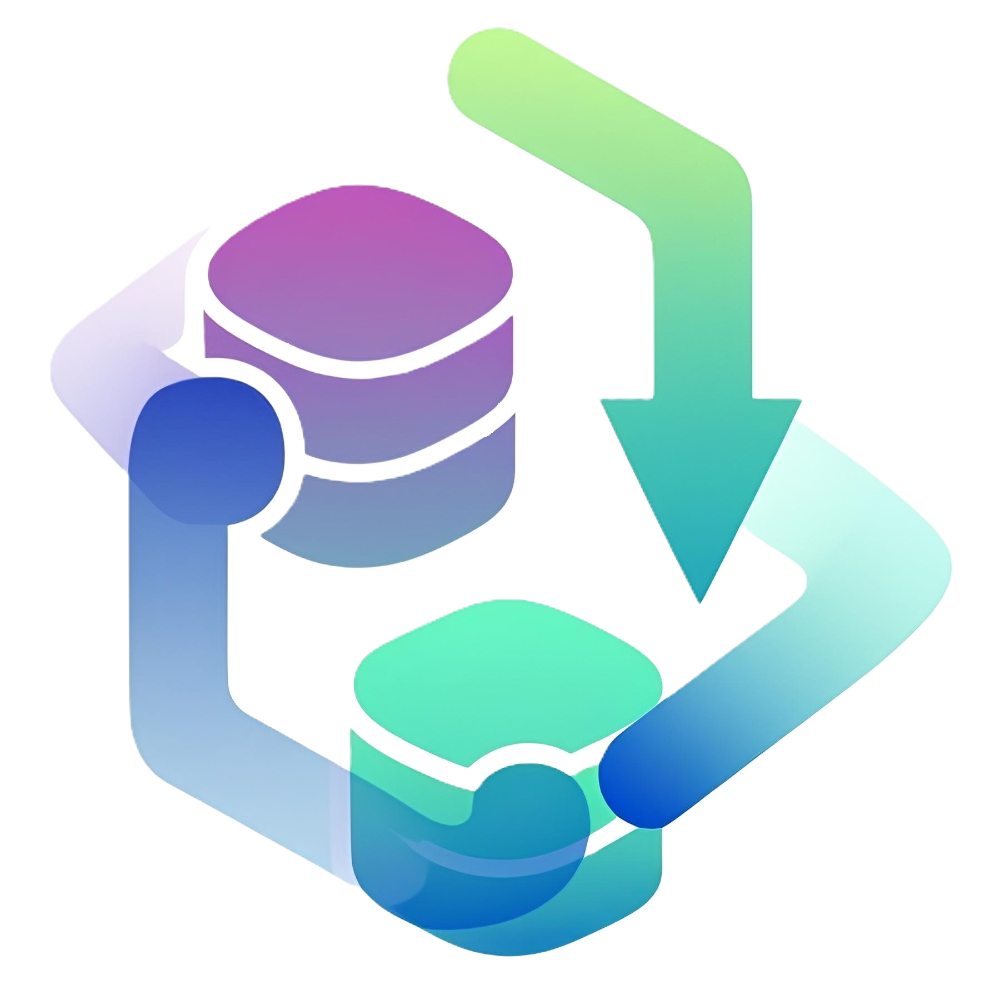

<h1 align="center">
  
  <div align="center">General Web App</div>
</h1>

<div align="center">

[](https://github.com/Yrrrrrf/gwa/releases/tag/v0.1.0-rc0)
[](https://github.com/Yrrrrrf/gwa)
[](https://choosealicense.com/licenses/mit/)

</div>

## 🚀 Overview

General Web App (GWA) is a comprehensive, full-stack application template
designed for rapidly developing modern, type-safe, and data-driven applications.
By integrating best-in-class technologies, GWA provides a robust foundation that
seamlessly bridges backend database operations with type-safe frontend
interfaces.

The key innovation in GWA is the **zero-friction data pipeline** between your
database schema and client applications, powered by
[**prism-py**](https://github.com/Yrrrrrf/prism-py) and
[**prism-ts**](https://jsr.io/@yrrrrrf/prism-ts). This ensures complete type
safety and automatic API generation from your database to your frontend with
minimal configuration.

## ✨ Features

- **Automatic API Generation** - Generate complete REST APIs directly from your
  database schema
- **End-to-End Type Safety** - Seamless type propagation from database to
  frontend
- **Cross-Platform** - Deploy as a web app, desktop application, or mobile app
- **Modern Stack** - Built with cutting-edge technologies focused on developer
  experience
- **Deno Integration** - First-class support for Deno's secure runtime
  environment
- **Production Ready** - Includes Docker setup, authentication, and CI/CD
  templates

## 🛠️ Technology Stack

### Backend

- **[Python](https://www.python.org/)** - High-level programming language
  - **[FastAPI](https://fastapi.tiangolo.com/)** - High-performance API
    framework
  - **[prism-py](https://github.com/Yrrrrrf/prism-py)** - Automatic API
    generation from database schemas
- **[PostgreSQL](https://www.postgresql.org/)** - Robust and scalable database

### Frontend

- **[Deno](https://deno.land/)** - Modern JavaScript/TypeScript runtime
- **[SvelteKit](https://kit.svelte.dev/)** - Full-stack Svelte framework with
  SSR capabilities
  - **[Tauri](https://tauri.app/)** - Build desktop applications with web
    technologies
- **[rune-lab](https://jsr.io/@yrrrrrf/rune-lab)** - UI component library built
  with Svelte 5
  - **[prism-ts](https://jsr.io/@yrrrrrf/prism-ts)** - Type-safe API client
    generation
- **[TailwindCSS](https://tailwindcss.com/)** - Utility-first CSS framework
- **[DaisyUI](https://daisyui.com/)** - Component library for TailwindCSS

## 🚦 Getting Started

### Prerequisites

- [Deno](https://deno.land/) >=1.40.0
- [Python](https://www.python.org/) >=3.12
- [PostgreSQL](https://www.postgresql.org/) >=13
- [Docker](https://www.docker.com/) (optional, for containerized setup)
- [Rust](https://www.rust-lang.org/) >=1.76 (optional, for Tauri desktop builds)

### Quick Start with Deno

```bash
# Clone the repository
git clone https://github.com/Yrrrrrf/gwa.git
cd gwa

deno task dev  # Start development server
deno task build  # Build for production
deno task preview  # Preview production build
deno task tauri build  # Build Tauri desktop app
```

### Docker Setup (Recommended for Backend)

```bash
# Start backend services with Docker Compose
docker compose up -d
```

### Database Configuration

Create a [`.env`](.env) file in the root directory:

```env
DB_NAME=gwa
DB_OWNER_ADMIN=gwa_owner
DB_OWNER_PWORD=password
DB_HOST=localhost
```

## 📚 Documentation

- [Local Setup Guide](./resources/docs/local-setup.md)
- [Unix Server Deployment](./resources/docs/unix-setup.md)

## 🔁 Development Workflow

GWA supports a streamlined development workflow:

1. **Define database schema** in PostgreSQL
2. **Auto-generate API** with prism-py
3. **Auto-generate TypeScript clients** with prism-ts
4. **Build UI** with Svelte 5 runes and rune-lab components
5. **Deploy** as web app or package as desktop app with Tauri

## 📄 License

This project is licensed under the MIT License - see the [LICENSE](LICENSE) file
for details.

## 👥 Contributing

Contributions are welcome! Please feel free to submit a Pull Request.

1. Fork the Project
2. Create your Feature Branch (`git checkout -b feature/AmazingFeature`)
3. Commit your Changes (`git commit -m 'Add some AmazingFeature'`)
4. Push to the Branch (`git push origin feature/AmazingFeature`)
5. Open a Pull Request

<!--
[](https://deno.land/)
[](https://www.python.org/)
[](https://www.postgresql.org/)
[](https://svelte.dev/)
[](https://tauri.app/)
-->
