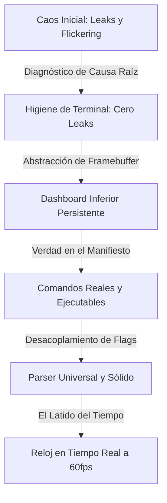

# 🌌 La Evolución del Pensamiento: Estrategia, Aroma y Síntesis

> *"El código elegante no es aquel al que no se le puede agregar nada más, sino aquel del que no queda nada por restar hasta que la forma y el propósito son indistinguibles."*

---

## 🕯️ 1. El Aroma del Proceso: La Intuición como Brújula

El software sofisticado rara vez nace de especificaciones rígidas; nace de la **fricción sentida**.
En esta sesión, el diseño no fue dictado por un diagrama estático, sino por un diálogo sensorial y estético entre la **intención humana** y la **ejecución agentual**:

* *"Esto parpadea."*
* *"¿Por qué desaparece la tabla si es lo más importante?"*
* *"¿Qué son esos caracteres extraños en mi terminal?"*
* *"El reloj debe contar en tiempo real... y al final detenerse."*

El **"aroma"** del proceso radica en cómo esa intuición cruda fue destilada en arquitectura pura. No se taparon los síntomas; se interrogó a la máquina desde primeros principios para que cada detalle tuviera peso, cadencia y verdad.

```
       [ INTUICIÓN HUMANA ]
      (Estética, Ritmo, Fricción)
                 │
                 ▼
       [ DIÁLOGO DIALÉCTICO ]
      (ASCII Mockups, Logs Reales)
                 │
                 ▼
     [ SÍNTESIS AGENTUAL ]
   (Primeros Principios, Código Puro)
                 │
                 ▼
     [ FORMA CRISTALINA (v0.1) ]
   (Cero Leaks, Framebuffer, 60fps)
```

---

## ⚡ 2. La Dialéctica: De la Fricción a la Forma

Cinco saltos evolutivos marcaron la transformación de un conjunto de scripts dispersos a un harness CLI de nivel producción:



### 1. El Fantasma en la Terminal (Higiene de Escape)
* **La Fricción**: Códigos parásitos (`^[]11;rgb:...`, `^[[14;13R`) contaminaban el prompt tras cada ejecución.
* **El Error Común**: Filtrar `stdout` con expresiones regulares o ignorar el problema como "un bug de terminal".
* **La Evolución del Pensamiento**: Interrogar *quién* hacía la pregunta. Se descubrió que `gum style` disparaba peticiones **OSC 11** (`\e]11;?`) para detectar el color de fondo del terminal, y `(term size)` emitía peticiones **DSR** (`\e[6n`).
* **La Cristalización**: Reemplazar dependencias externas por formateo ANSI nativo en memoria `(ansi -e { fg: $color, attr: b })` y navegación relativa `\e[<H>A\e[0J`. **Resultado: Cero bytes de basura en el terminal.**

### 2. El Framebuffer Virtual (El Dashboard que Nunca Muere)
* **La Fricción**: Scripts imprimiendo líneas a medida que ocurrían eventos. La tabla se redibujaba al final, el historial se pisaba y la vista previa `OVERVIEW` duplicaba innecesariamente la información.
* **La Evolución del Pensamiento**: Tratar la salida estándar no como un rollo de papel continuo, sino como una **pantalla reactiva impulsada por estado**.
* **La Cristalización**:
  ```nu
  # Un único estado inmutable -> Una función pura de renderizado
  build-table-lines $state_records $is_bench $frame $running_elapsed
  ```
  La tabla existe en la base desde el fotograma cero. Los registros de compilación fluyen *por encima* de ella en tiempo real. Cuando una tarea avanza, el cursor retrocede de forma atómica y redibuja la tabla sincronizada con la realidad.

### 3. Verdad en el Manifiesto (Comandos Ejecutables)
* **La Fricción**: Imprimir pseudocódigo vago como `deno run -A npm:vite build (in apps/vision)`.
* **La Evolución del Pensamiento**: En las herramientas para desarrolladores, la simulación genera desconfianza. Lo que se imprime en pantalla debe ser exactamente lo que el desarrollador puede copiar, pegar y ejecutar en su propia terminal.
* **La Cristalización**:
  - **Plantilla abstracta**: `cd <apps/*> && deno run -A npm:vite build` (con tokens dinámicos en cian negrita cursiva).
  - **Manifiesto concreto**: `cd apps/vision && deno run -A npm:vite build` (con rutas reales en negrita).

### 4. La Entropía de los Argumentos (Centralización Universal)
* **La Fricción**: Al invocar cadenas de dependencias en Just (`ci *args: (check args) (test args)`), Just empaquetaba los argumentos en una sola cadena `" -v -b "`. Las comprobaciones ingenuas fallaban y flags como `-v` o `-b` se descartaban en silencio. Peor aún, `just preview -v` interpretaba `-v` como el nombre de una carpeta e intentaba ejecutar `cd apps/-v`.
* **La Evolución del Pensamiento**: Dejar de parchear recetas individuales y formalizar un analizador léxico centralizado en `scripts/cli/flags.nu`.
* **La Cristalización**:
  - Tokenización de cadenas empaquetadas por espacios en blanco.
  - Soporte nativo de combinaciones cortas (`-vb`, `-bv`, `-vd`).
  - Desacoplamiento total del objetivo posicional: `just build vision -vb` y `just build -vb vision` producen idéntico estado.

### 5. El Latido del Tiempo (El Reloj Vivo)
* **La Fricción**: Tareas silenciosas o tiempos estáticos que solo aparecen al terminar, dejando al desarrollador en la incertidumbre durante procesos pesados de Vite o TypeScript.
* **La Evolución del Pensamiento**: Darle vida y pulso al proceso. El tiempo no debe ser un reporte forense; debe ser una experiencia en vivo.
* **La Cristalización**: En el bucle de animación de 60ms, la diferencia de tiempo `((date now) - $start)` se recalcula en memoria en cada fotograma. El reloj avanza visiblemente:
  ```text
  ❯❯ svelte-check  state   ⠙ running... (840ms)
  ```
  Y en el instante exacto en que el proceso termina, el reloj **se detiene y se congela**:
  ```text
  ❯❯ svelte-check  state   (4 files, 0 errors, 0 warnings) (1.83s)
  ```

---

## 🏛️ 3. Principios Heurísticos Replicables (El Manual para Sesiones Futuras)

Para replicar esta misma velocidad, profundidad y robustez en cualquier otra sesión o arquitectura, aplíquense estas cuatro heurísticas:

### Heurística A: Anclaje Visual Inmediato (Visual Grounding First)
* Un esquema ASCII con la posición exacta del cursor (`| <-- ALWAYS HERE!`) o un snippet de terminal crudo vale más que diez párrafos descriptivos.
* **Regla**: Diseñar la interfaz en texto plano antes de escribir la primera línea de código del renderizador.

### Heurística B: Memoria Pura en el Bucle Caliente (Zero-Process Render Loop)
* Cualquier invocación de subprocesos externos (`gum`, `tput`, `stty`, `date`) dentro de un bucle de 60ms destruye la experiencia: introduce latencia, parpadeo y sondeos de terminal que terminan en fugas de caracteres.
* **Regla**: Todo cálculo de tiempo, formateo ANSI y cálculo de diferencias en un bucle visual debe resolverse en memoria nativa del runtime (en este caso, Nushell nativo).

### Heurística C: Apego Inflexible a las Invariantes del Lenguaje
* El código falla cuando se trata a un lenguaje moderno como si fuera otro antiguo (ej. escribir Nushell pensando en Bash).
* **Regla**: Guiar la implementación según las invariantes codificadas en habilidades de referencia (`.skills/ci/nushell/SKILL.md`):
  - Firmas estrictamente tipadas: `def --wrapped main [...raw: string]: nothing -> nothing`.
  - Preferir transformaciones funcionales (`where`, `each`, `reduce`) sobre bucles mutables.
  - Normalización defensiva de rutas: `path expand | path relative-to $env.PWD`.

### Heurística D: Estratificación Progresiva (Layered Mastery)
* Nunca intentar resolver el diseño visual, el análisis de argumentos y el paralelismo en un solo paso monumental.
* **Regla**: Avanzar por capas herméticas:
  1. **Capa 0**: Separación modular de responsabilidades (`workspace`, `ui`, `runner`, `gates`).
  2. **Capa 1**: Higiene y anclaje de salida (eliminar fugas de escape).
  3. **Capa 2**: El Framebuffer de estado (renderizado puro y predecible).
  4. **Capa 3**: El Protocolo de argumentos (normalización de flags).
  5. **Capa 4**: Telemetría viva y dinamismo (el reloj y la respiración del CLI).

---

## 🧭 Epílogo: El Artefacto Vivo

El resultado final no es una herramienta utilitaria rígida; es una pieza de software con **carácter, honestidad técnica y armonía visual**.
Un CLI que no engaña, que respeta la terminal, que informa sin saturar y que devuelve al desarrollador el control total sobre su entorno.
