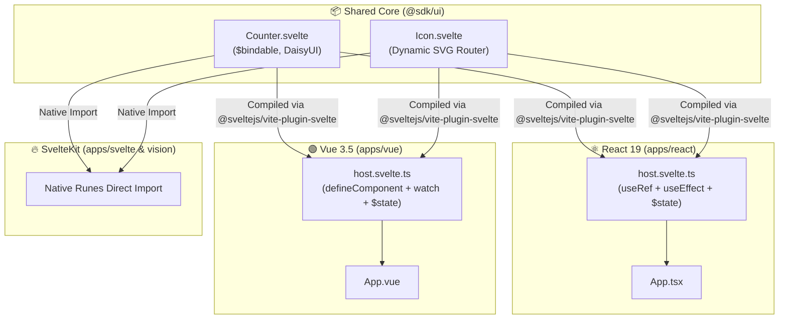
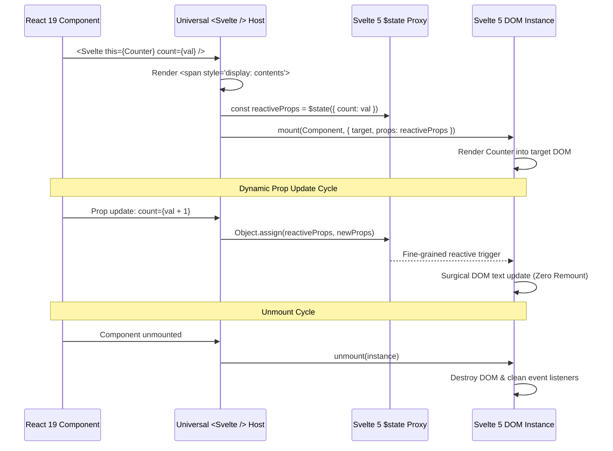

# 🌐 Universal `<Svelte />` Host: Runes Everywhere

> *"Write once in Svelte 5 Runes; render natively anywhere with zero runtime compromise."*

---

## 🧭 1. Executive Summary & Philosophy

In modern full-stack architectures, framework lock-in has traditionally fragmented UI component libraries. Teams either maintain separate duplicate component suites for React, Vue, and Svelte, or rely on heavy Web Components abstractions that lose framework-native ergonomic reactivity.

With **Svelte 5 runes**, Svelte shifts from a compile-time transformation model to a **fine-grained, runtime reactive proxy model** powered by explicit primitives (`$state`, `$derived`, `$effect`, `$bindable`). Crucially, Svelte 5 components are programmatically instantiated via lightweight runtime primitives:

```ts
import { mount, unmount } from "svelte";

const instance = mount(Component, { target: domElement, props: reactiveState });
```

This workspace takes this capability to its logical, production-grade conclusion:
**Svelte 5 is the universal UI primitive for the entire monorepo.** 
Both **React 19** and **Vue 3.5** mount and drive Svelte 5 components natively with seamless two-way reactivity, zero layout disruption, and zero warning quality gates.

---

## 🗺️ 2. Architectural Topology



---

## ⚡ 3. The React 19 Universal Host

**Source**: [`apps/react/src/lib/host.svelte.ts`](file:///home/yrrrrrf/Documents/lab/tek/packages/gwa/template/src/client/apps/react/src/lib/host.svelte.ts)

### How It Works

1. **Invisible Host Wrapper**:
   Renders a polymorphic DOM tag (defaults to `<span>`) with `style={{ display: "contents" }}`. The wrapper element itself generates no CSS box, allowing children to participate directly in flexbox, grid, or flow layouts as if the wrapper did not exist.
2. **Reactivity Bridge**:
   - Inside React's `useEffect`, we instantiate a Svelte 5 reactive proxy:
     ```ts
     const reactiveProps = $state({ ...props });
     ```
   - On subsequent React render passes, React's props are assigned into the Svelte proxy via `Object.assign(reactivePropsRef.current, props)`.
   - Mutating `$state` triggers Svelte 5's internal dependency graph surgically without remounting the component.
3. **Clean Teardown**:
   When React unmounts the host node, the effect cleanup runs `unmount(instance)`.



### Usage in React 19:

Components can be invoked directly as native React components (pre-adapted via `toReact`), or dynamically via the `<Svelte />` host wrapper:

```tsx
import { Counter, Icon, Svelte } from "#lib";

export function App() {
  const [count, setCount] = useState(0);

  return (
    <div className="flex flex-col gap-4">
      {/* 1. Direct invocation (adapted via toReact) */}
      <Icon route="/dashboard" size={24} color="currentColor" />
      <Counter count={count} onchange={setCount} />

      {/* 2. Dynamic host invocation (when component is dynamic) */}
      <Svelte this={Icon} route="/settings" size={20} />
    </div>
  );
}
```

---

## 🟢 4. The Vue 3.5 Universal Host

**Source**: [`apps/vue/src/lib/host.svelte.ts`](file:///home/yrrrrrf/Documents/lab/tek/packages/gwa/template/src/client/apps/vue/src/lib/host.svelte.ts)

### How It Works

Vue 3.5 uses explicit render functions and composition API primitives (`defineComponent`, `ref`, `watch`, `h`):

1. **DOM Container**:
   `h(props.as, { ref: containerRef, style: { display: "contents" } })` renders a transparent DOM node.
2. **Dual-Proxy Synchronization**:
   - In Vue's `onMounted`:
     ```ts
     const reactiveProps = $state({ ...attrs });
     instance = mount(props.this, { target: containerRef.value, props: reactiveProps });
     ```
   - In Vue's `watch`:
     ```ts
     watch(
       () => ({ ...attrs }),
       (newAttrs) => {
         if (reactivePropsRef.value) Object.assign(reactivePropsRef.value, newAttrs);
       },
       { deep: true },
     );
     ```
   - Vue's reactivity system notifies the deep watcher; the watcher mutates the Svelte `$state` proxy; Svelte updates the DOM with zero vDOM diffing overhead.
3. **Lifecycle Teardown**:
   Vue's `onUnmounted` invokes `unmount(instance)`.

### Usage in Vue 3.5:

Components can be invoked directly as native Vue components (pre-adapted via `toVue`), or dynamically via the `<Svelte />` host wrapper:

```vue
<script setup lang="ts">
import { Counter, Icon, Svelte } from "#lib";
</script>

<template>
  <div class="flex flex-col gap-4">
    <!-- 1. Direct invocation (adapted via toVue) -->
    <Icon route="/dashboard" :size="24" color="currentColor" />
    <Counter />

    <!-- 2. Dynamic host invocation (when component is dynamic) -->
    <Svelte :this="Icon" route="/settings" :size="20" />
  </div>
</template>
```

---

## 🛠️ 5. Shared Primitives: `sdk/ui`

**Source**: [`sdk/ui/src/`](file:///home/yrrrrrf/Documents/lab/tek/packages/gwa/template/src/client/sdk/ui/src/)

### 1. `Counter.svelte`
DaisyUI button group with full support for:
- Two-way binding via `$bindable(count)`.
- Explicit callbacks via `onchange?: (value: number) => void`.
- Fully reactive inside React, Vue, and SvelteKit.

### 2. `Icon.svelte`
Accessible SVG route indicator:
- Determines whether to render an interactive route button or an inline SVG glyph.
- Dynamic Lucide icon lookup based on semantic application routes (`/dashboard`, `/settings`, `/profile`, etc.).

---

## 🛡️ 6. The "Overkill" Resilience Engineering

Integrating multiple UI engines into a single workspace while maintaining strict typing and zero-warning gates required overcoming several architectural hurdles:

### 1. Zero Root Poisoning for Framework Tooling
- Framework plugins (`@vitejs/plugin-react`, `@vitejs/plugin-vue`, `@sveltejs/vite-plugin-svelte`) are kept **strictly inside their respective package descriptors** (`apps/react/deno.json`, `apps/vue/deno.json`).
- Root [`deno.json`](file:///home/yrrrrrf/Documents/lab/tek/packages/gwa/template/src/client/deno.json) and [`config/vitest.config.ts`](file:///home/yrrrrrf/Documents/lab/tek/packages/gwa/template/src/client/config/vitest.config.ts) remain **completely framework-agnostic**.
- Vitest projects discover package-level `vite.config.ts` files dynamically, allowing each app to bundle its own compiler pipeline without conflicts.

### 2. SSR Externalization Bypass (`rune-lab`)
- **The Issue**: Dependencies shipping uncompiled `.svelte` code in `node_modules` (e.g. `rune-lab`) cause Node/Vitest SSR runners to throw `SyntaxError: Unexpected token '<'`.
- **The Solution**: Configured `ssr: { noExternal: ["rune-lab"] }` in [`config/app.config.ts`](file:///home/yrrrrrf/Documents/lab/tek/packages/gwa/template/src/client/config/app.config.ts), instructing Vite to always bundle and transform Svelte dependencies through the compiler before running tests.

### 3. The TypeScript 7 / `vue-tsc` Immunity Layer
- **The Issue**: TypeScript 7.0.2 introduced an explicit `"exports"` map in `package.json` that omits `./lib/tsc`. `vue-tsc@3.3.11` relies on `require.resolve('typescript/lib/tsc')`, causing crashes when TypeScript 7 is installed.
- **The Solution**: 
  - Declarative matrix rule in [`scripts/check.just`](file:///home/yrrrrrf/Documents/lab/tek/packages/gwa/template/src/client/scripts/check.just) pins `npm:typescript@6/tsc`.
  - [`scripts/cli/workspace.ts`](file:///home/yrrrrrf/Documents/lab/tek/packages/gwa/template/src/client/scripts/cli/workspace.ts) provides `ensureNodeCompat()` to verify node module layouts and symlinks, ensuring `vue-tsc` always points to a compatible compiler with zero runtime errors.

---

## 📊 7. Verification & Quality Gate Matrix

Every commit and check routine verifies the entire ecosystem in parallel:

| Gate | Tool / Engine | Targets | Status |
| :--- | :--- | :--- | :--- |
| **Format** | Biome | Workspace | `0 fixes needed` |
| **Lint** | Biome | Workspace | `0 errors, 0 warnings` |
| **Types** | `svelte-check` | `sdk/state`, `apps/svelte`, `apps/vision` | `0 errors, 0 warnings` |
| **Types** | `deno check` | `sdk/core`, `sdk/api`, `sdk/ui` | `0 errors, 0 warnings` |
| **Types** | `tsc` (TypeScript 6) | `apps/react` | `0 errors, 0 warnings` |
| **Types** | `vue-tsc` | `apps/vue` | `0 errors, 0 warnings` |
| **Tests** | Deno Test | `sdk/core` | `100% passed` |
| **Tests** | Vitest | `sdk/state`, `apps/react`, `apps/vue`, `apps/svelte`, `apps/vision` | `100% passed` |
| **Build** | Vite / SvelteKit | `apps/react`, `apps/vue`, `apps/svelte`, `apps/vision` | `4/4 successful` |

To run the complete suite locally:
```bash
just prepare
just ci -vp
just build -vp
```
